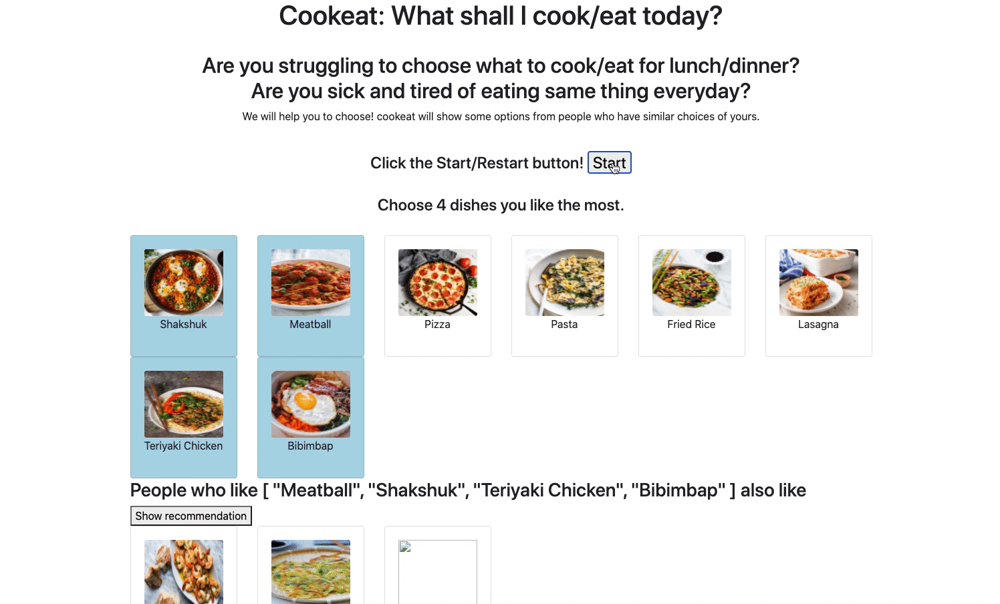

# Food Recommendation System

This project was built for MSTU 5013 Theory and Programming of Interactive Media in 2020.

## Background

If you begin cooking regularly, you'll soon realize that selecting a menu is just as difficult as cooking. To avoid this hassle, I created a simple food recommendation system that uses data collected from users. This system recommends meals based on your preferences, making it easier for you to decide what to cook.

## How it works
Please select four of your favorite dishes from the list. Based on your choices, the code will find another user with the most similar food preferences. Then, the system will recommend new or favorite dishes that the similar user has chosen based on their preferences. This way, you can discover new dishes that are likely to appeal to your taste buds.


## Recommendation system
Upon entering their favorite food, the system will identify a user with similar preferences by analyzing the overlap in food choices.
```
    //find a user index that has a maximum overlapping food choices with the user
    var commonFoodLengths = [];
    for (var i=0; i< this.datapools.length; i++ ) {
    var commonFood = this.userFood.filter(object => this.datapools[i].some(v => v.id === object.id ));
    commonFoodLengths.push(commonFood.length)
    };
    var tmpIndex = commonFoodLengths.indexOf(Math.max.apply(null, commonFoodLengths));
```

Then, a list of food recommendation for the user will be created by 1) and 2).
1) by excluding overlapped food choices for both users
```
    this.recommendations = this.datapools[maxOverlappedIdx].filter(
    (object) => !this.userFood.find((v) => v.id === object.id)
    );
```
2) by excluding food that a user did not choose from the initial food list.
```
  this.recommendations = this.recommendations.filter(
    (object) => !this.choicepools.find((v) => v.id === object.id)
  );
```

## Time complexity improvement for searching a userData which has similar preference
When the user clicks the 'Show recommendation' button, the system will identify the data with the longest overlap from the pool of previous users' favorite foods and the current user's food choices (this.userFood).

Hence, instead of loop through both this.userFood array and this.datapools array which takes O(n * m * k), 
[n = length of this.food, m = length of each datapool element, k = length of each datapool element] 
we can insert this.userFood into hash set. Then, when Javascript loop through this.datapool array, it will calculate number of overlapped food by looking up hash set.
This will improve overall time complexity by O(n*m), although take up extra O(n) memory.
```
      let commonFoodLengths = [];
      let userFoodSet = new Set(this.userFood);
      let maxOverlappedIdx = 0, curOverlappedFoodLen = 0;
      for (var i = 0; i < this.datapools.length; i++) {
        this.datapools[i].forEach((v) => {
          if(userFoodSet.has(v.id)) curOverlappedFoodLen++;
        });
        maxOverlappedIdx = Math.max(maxOverlappedIdx, curOverlappedFoodLen);
      }
```

## User data pool
I assume that I already have 20 users' favorite food data('datapools'). By clicking the start button, the 'datapools' will be randomly created. When you choose 4 favorite dishes, the code will also push your '4 favorite dishes' data into the datapool.
```
     //Although numFood is hard-corded version for now, this can be placed in app config file for real use.
     const numFood = 8;
     for (var i = 0; i < numPerson; i++) {
        var favFood = [];
        while (favFood.length !== numFood) {
          favFood.push(
            this.foodPools[Math.floor(Math.random() * this.foodPools.length)]
          );
          favFood = [...new Set(favFood)];
        }
        this.dataPools.push(favFood);
      }
```

<!-- LICENSE -->

## License

Distributed under the MIT License. See `LICENSE` for more information.
